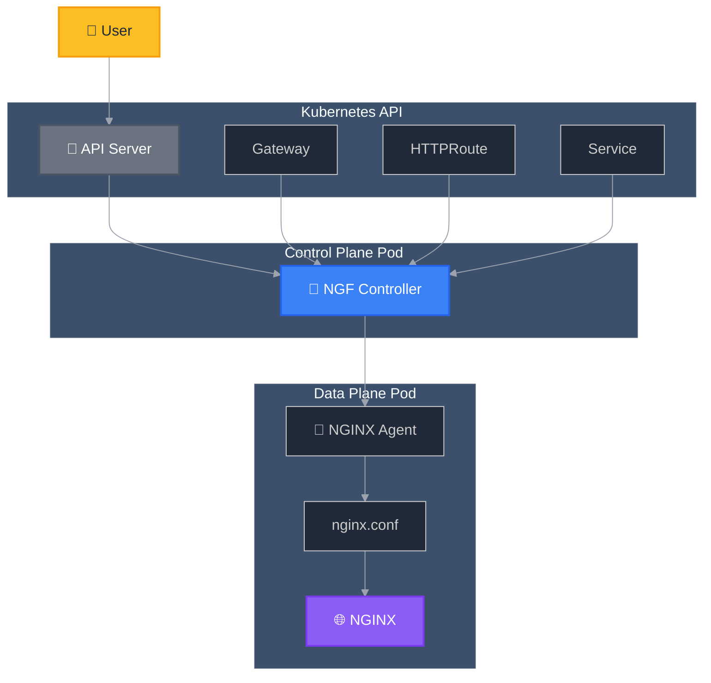
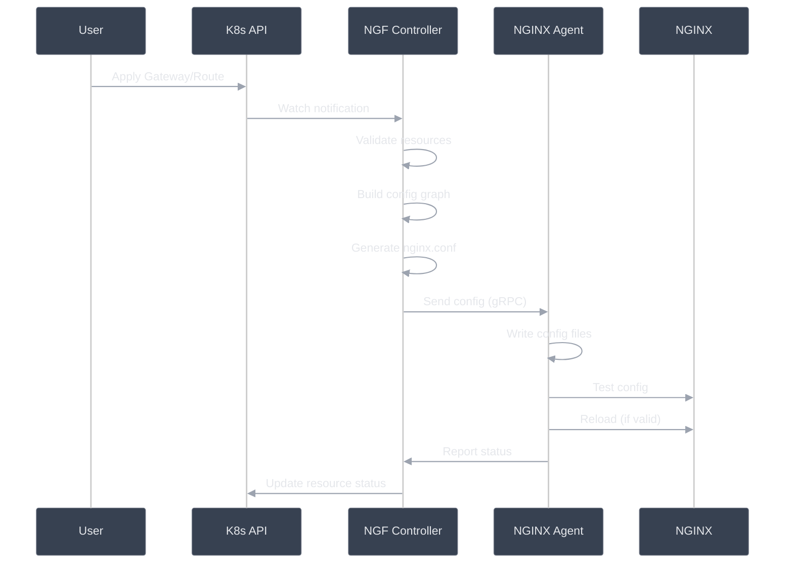

# Configuration Flow

This diagram shows how Gateway API resources become NGINX configurations.

## Simple Overview



## Step-by-Step Process

### 1. User Creates Resources

```yaml
# User applies Gateway API resources
apiVersion: gateway.networking.k8s.io/v1
kind: Gateway
metadata:
  name: my-gateway
```

### 2. Kubernetes Stores Resources

- Gateway, HTTPRoute, Service resources stored in etcd
- Kubernetes API Server notifies watchers of changes

### 3. NGF Controller Processes Changes

```text
NGF Controller:
├── Watches Gateway API resources
├── Validates configurations
├── Builds internal config graph
└── Generates NGINX configuration
```

### 4. Configuration Sent to Data Plane

```text
Control Plane → Data Plane:
├── gRPC connection (secure)
├── nginx.conf file contents
├── SSL certificates
└── Other config files
```

### 5. NGINX Agent Updates Configuration

```text
NGINX Agent:
├── Receives config from control plane
├── Validates NGINX syntax
├── Writes files to disk
├── Tests configuration
└── Reloads NGINX (if valid)
```

## Detailed Configuration Flow



## What Gets Generated?

### NGINX Configuration Files

- **nginx.conf**: Main configuration
- **servers.conf**: Virtual server definitions
- **upstreams.conf**: Backend service definitions
- **maps.conf**: Request routing maps

### Example Generated Config

```nginx
# Generated from Gateway API resources
server {
    listen 80;
    server_name api.example.com;

    location /users {
        proxy_pass http://user-service;
    }

    location /orders {
        proxy_pass http://order-service;
    }
}
```

## Error Handling

### Invalid Configuration

1. **NGF validates** Gateway API resources
2. **NGINX Agent tests** generated config
3. **Rollback** if configuration is invalid
4. **Status updates** report errors to Kubernetes

### Recovery Process

- Keep last known good configuration
- Report errors in resource status
- Retry configuration updates
- Graceful degradation when possible
