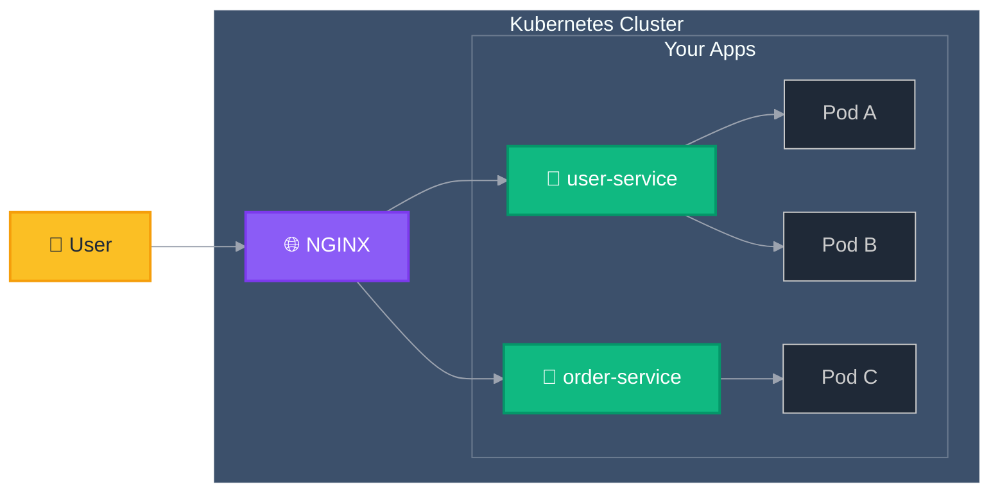
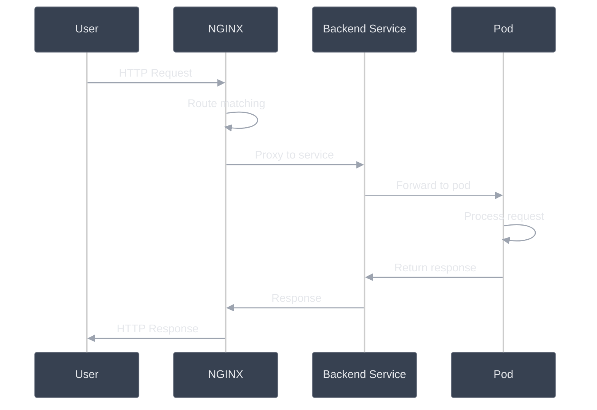

# Traffic Flow

This diagram shows how user requests travel through NGINX Gateway Fabric.

## Simple Overview



## Traffic Processing Steps

### 1. User Sends Request

```text
User Request:
├── GET /users
├── POST /orders
├── Headers: Authorization, Content-Type
└── Body: JSON data (if needed)
```

### 2. NGINX Receives Request

```text
NGINX Gateway:
├── Receives request from user
├── Applies SSL termination
├── Matches routing rules
└── Selects backend service
```

### 3. Service Processes Request

```text
Backend Service:
├── Receives request from NGINX
├── Processes business logic
├── Queries database (if needed)
├── Generates response
└── Returns response to NGINX
```

### 4. Response Returns to User

```text
Response Flow:
├── Service → NGINX
├── NGINX → User
└── Request complete
```

## Detailed Request Flow



## Request Routing Logic

### Path-Based Routing

```nginx
# Generated from HTTPRoute resources
location /users {
    proxy_pass http://user-service;
}

location /orders {
    proxy_pass http://order-service;
}

location /products {
    proxy_pass http://product-service;
}
```


### Host-Based Routing

```nginx
# Different hosts route to different services
server {
    server_name api.example.com;
    location / {
        proxy_pass http://api-service;
    }
}

server {
    server_name admin.example.com;
    location / {
        proxy_pass http://admin-service;
    }
}
```
